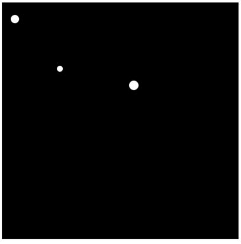
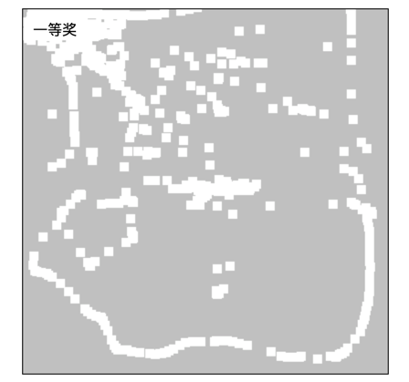
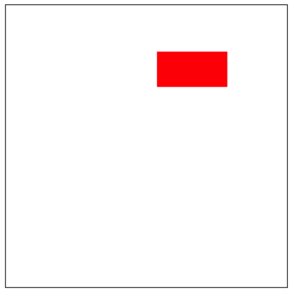
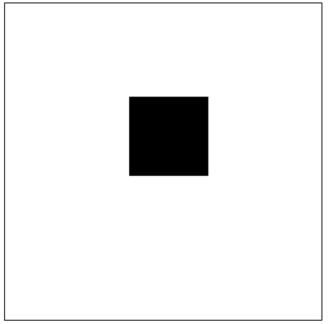

|实例||
|:-----|:----|
|小球下落效果||
|小球下落效果-多个||
|刮刮乐||
|碰壁反弹||
|按压移动跟随||

1. canvas动画
	requestAnimationFrame，函数，为动画而设计的接口，相比计时器制作的要流畅得多，占用资源少
	var id = requestAnimationFrame(fn)
	cancelAnimationFrame(id)

2.canvas动画跟DOM动画比较
	canvas性能好，绘制之前要先擦除画布
	DOM动画比较消耗性能，也不够流畅

3.擦除画布的方法
	ctx.clearRect(0,0, canvas.width, canvas.height)
	canvas元素的宽高变化会擦除画布所有的内容
	canvas.width = canvas.width
	canvas.height = canvas.height

	只能擦除绘制在canvas上的内容，css样式里的不能擦掉

4.  e.offsetX/e.offsetY 相对绑定元素的坐标
	e.clientX/e.clientY 相对浏览器窗口/视口的坐标

	刮刮乐效果，原理擦除鼠标在canvas中的坐标中的内容
				a.添加事件touchmove/mousemove
				b.找到鼠标相对canvas的坐标
				c.ctx.clearRect(x, y, 10, 10)

5. ctx.isPointInPath(x,y) 判断点(x,y)是否在路径里，返回布尔值
	
	以下三个方法不会产生路径
	ctx.fillRect()
	ctx.strokeRect()
	ctx.clearRect()

|实例|||
|:-----|:----|:----|
|[链式球](./链式球/canvasStar.html)|实现结构，有了事件函数| |
|[弹幕](./弹幕/index.html)|||

|实例|||
|:-----|:----|:----|
|[游戏人物控制](./游戏人物控制/index.html)|实现结构，有了事件函数| |

