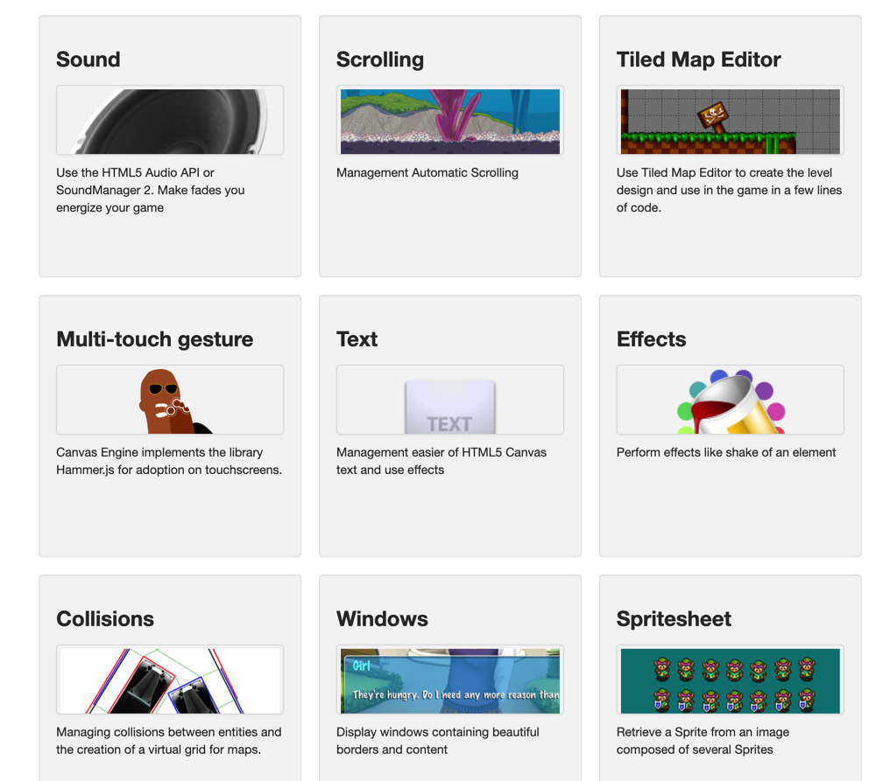

|框架|描述||
|:----|:----|:----|
|pixijs   [pixi官网](https://www.pixijs.com/) [pixi中文教程](https://github.com/Zainking/LearningPixi#tileset) [入门介绍](https://juejin.cn/post/6844904020939636744)|是一个轻量级的2D渲染引擎，它能自动侦测使用WebGL还是Canvas来创建图形。这个库经常被用来制作HTML5游戏以及有复杂交互的H5活动页。 复杂动画可以依赖第三方库 Tween.js，TweenMax;通过《pixi中文教程》可以了解代码结构如何设计||
|CanvasEngine|CanvasEngine is no longer maintained, please take another framework like PixiJS or PhaserJS  ； https://canvasengine.net/| |
|canvas最佳实践项目模板|https://github.com/christopher4lis/canvas-boilerplate/tree/master/src/js||