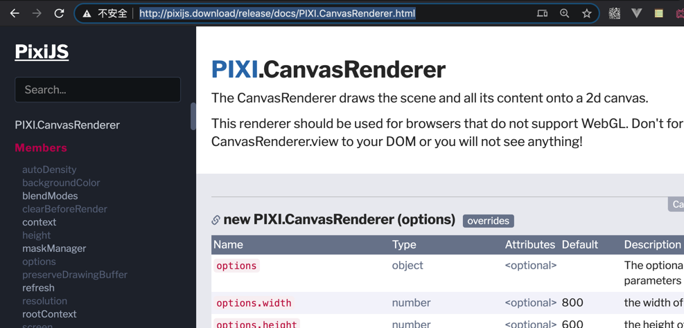
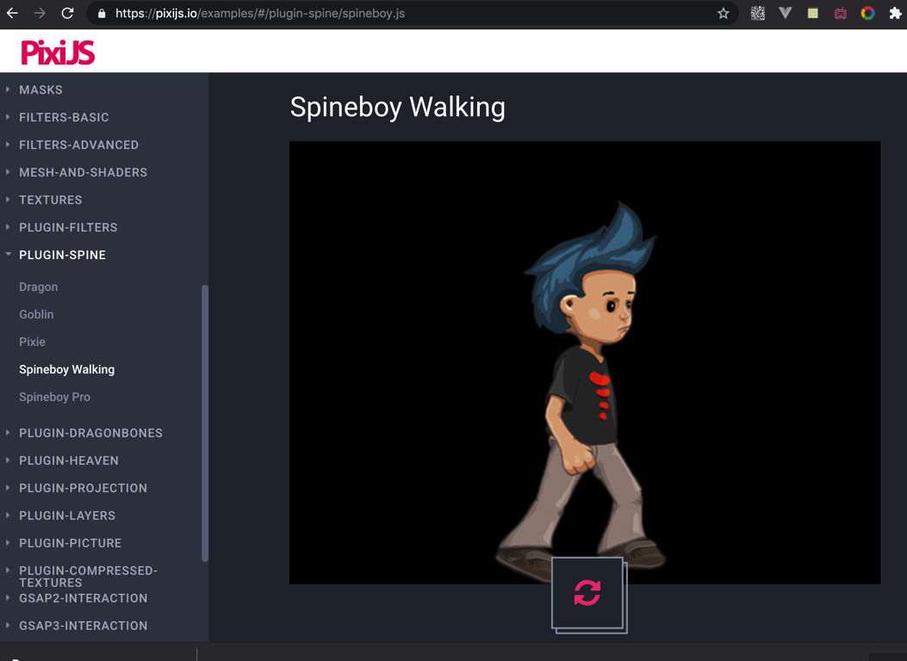
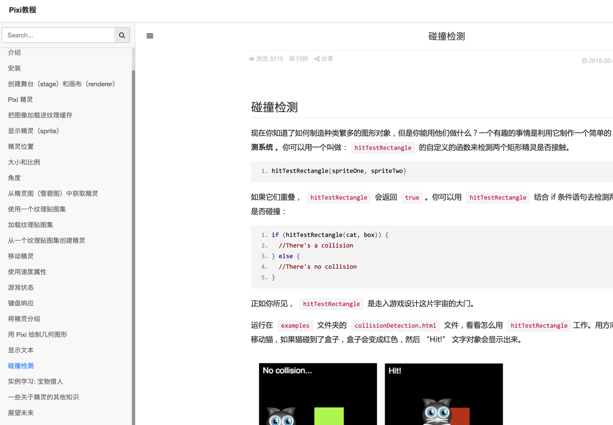
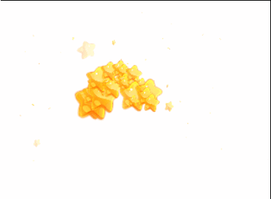
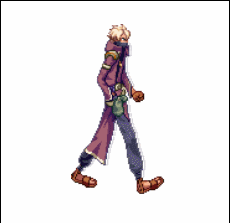
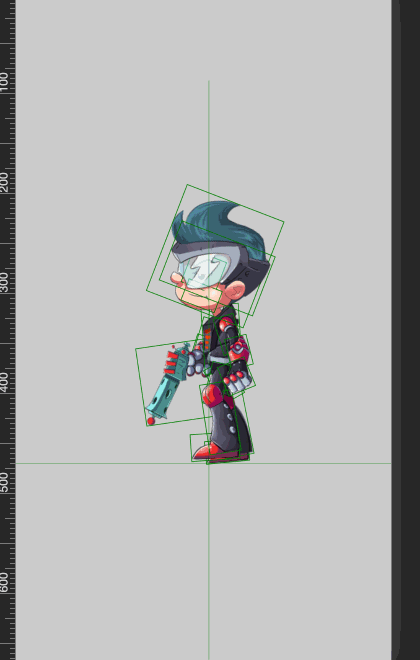
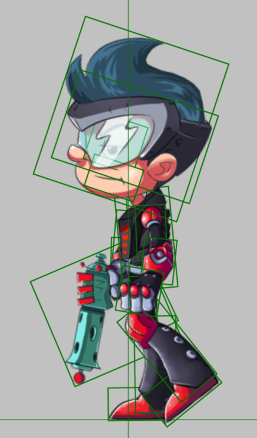
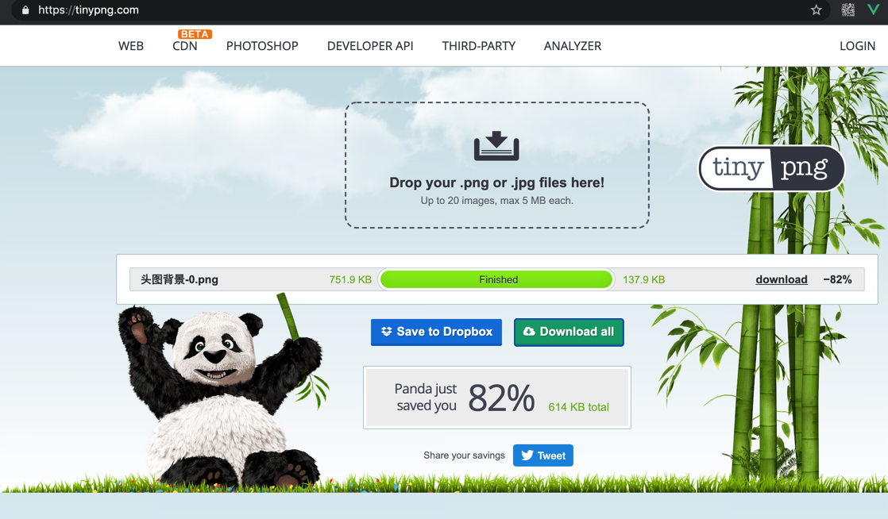

# pixi 高级用法-After Effects
|资料|说明|
|:----|:----|
|Bodymovin|Bodymovin 是一个 After Effects 插件，用来将动画导出成 svg/canvas/html + js ，方便在浏览器上展示。 https://codepen.io/airnan/pen/yapJWq |
|lottie-web | https://www.yuque.com/antfe/blog/fu6hnr  https://github.com/airbnb/lottie-web|

# pixi 系统学习资料
|资料|说明|
|:----|:----|
|[官网文档](http://pixijs.download/release/docs/index.html) 很完整，和MDN一样，适合查询|  |
|[pixi examples](https://pixijs.io/examples/)||
|[pixi官网推荐的动画插件-精灵效果](https://pixijs.io/examples/#/plugin-spine/dragon.js)||
|[pixi中文教程](https://www.bookstack.cn/read/LearningPixi/collision) 新手友好||
|[pixi系列教程-粒子效果](https://juejin.cn/post/6844903765108260872)||
|[H5场景小动画实现之PixiJs实战](https://zhuanlan.zhihu.com/p/31293136)||
|扩展插件[pixi-action](http://git.hust.cc/pixi-action/) 这些函数都比较简单，没有抛物线； 算是demo级别的。项目中用需要加强基础函数能力||
|[After Effects to PIXI.js](https://codepen.io/airnan/pen/yapJWq)||
 
# pixi 实例
|实例|描述|
|:----|:----|
|[pixi精灵示例](https://juejin.cn/post/6844903760561438728)|  、 |
|[pixi解决模糊问题](http://pixijs.download/release/docs/PIXI.AbstractRenderer.html#resize) https://www.cnblogs.com/haqiao/p/12515775.html||
|[pixi粒子库-dust](https://blog.csdn.net/fe_dev/article/details/86559206) |Pixi 没有内置的制作粒子效果的功能，但你可以使用一个名为 Dust 的轻量级的库来制作它们。 [效果展示](https://www.kkkk1000.com/images/learnPixiJS-ParticleEffects/ParticleContainer.html)  [发射效果](https://www.kkkk1000.com/images/learnPixiJS-ParticleEffects/emitter.html)|
|[pixi补间动画](http://demo.htmleaf.com/1501/201501271734/index13.html)|tween.js强大的可生成平滑动画效果的js库|
|pixi消除锯齿| [antialias参数](http://pixijs.download/release/docs/PIXI.AbstractRenderer.html#backgroundColor)  这种方法没生效 https://zhuanlan.zhihu.com/p/56029920|
|pixi事件不生效，解决 `元素名.interactive=true` |https://blog.csdn.net/sttk111/article/details/105678751/  提前看一遍文档是能解决这个问题的|
|pixi 触摸canvas画布 不能滑动页面问题| 这个问题折腾了很久,很多资料不完整，最后查看页面属性 touch-action, 然后在源代码库中找到解决方法 https://github.com/pixijs/pixi.js/issues/4824  |
|pixi声音|http://pixijs.io/pixi-sound/examples/#section-playing|
| 熊猫压缩工具 https://tinypng.com/||
|container官网示例|https://pixijs.io/examples-v4/#/demos-basic/container.js|
|pixi资料不足，例如 不知道 text怎么用时|看源代码解决  https://github.com/pixijs/pixi.js/blob/00af8df56cfeadbc22bc5c2a1305eb8518fef993/packages/text/src/Text.ts|

